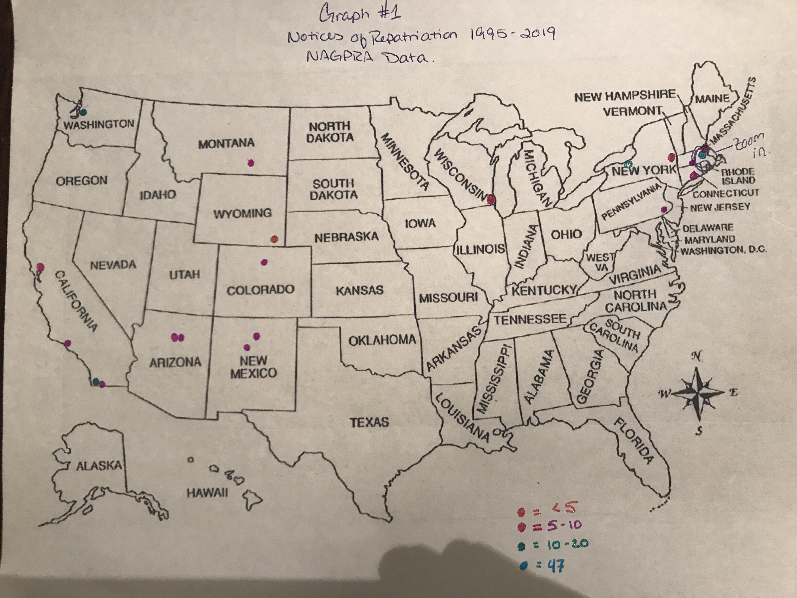
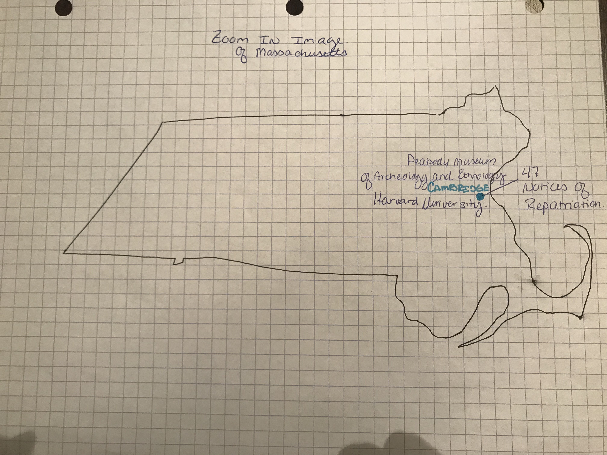
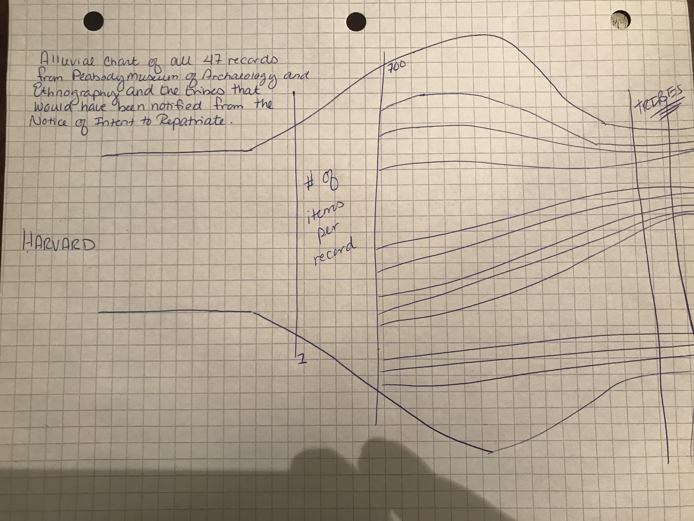

# Final Project
## Part I
### Outline
This project will create a visualization of all Notices of Intent to Repatriate from the Native American Graves Protection and Repatriation Act by state from 1995 through 2019.  This data will then be compared to the data of all federally recognized tribes in the United States and draw conclusions of the number of repatriation claims by tribe. The goal of this project is to have the audience understand trends in repatriation over the past 25 years and come away with a sense of advocacy for the cultural ethics and policy surrounding these issues. 
#### This goal will be accomplished through this story arc:
Setup - Colonialization in the United States has had the effect of lost land, lost lives, and lost cultural heritage of the American Indian tribes.

Conflict - Musuems hold art and artifacts in their collections in public trust, but these artifacts were originally taken or excavated during the expansion of the U.S. and must be returned to their rightful owners. 

Resolution - Repatriation of art and artifacts would write a new narrative of a shared cultural history. 

### Data
[Indian Lands and Native Entities, Open-source Data](https://hifld-geoplatform.opendata.arcgis.com/datasets/indian-lands-and-native-entities)

[NAGPRA](https://www.nps.gov/nagpra/FED_NOTICES/NAGPRADIR/index2.htm)
[Data from NAGPRA](NAGPRA_Data.md)

### Method and Medium
I will have to use a variety of programs to create my visualization. First, I will need to use OpenRefine to clean the two datasets and possibly add attributes to reflect what I want to show. Second, I will be using Infogram to build the wireframing and storyboards, and ultimately using Shorthand or Storymaps to present my project. My goal is to create a time-lapse map of repatriations over the past 25 years as well as a supporting graph to show to which tribes are the majority of repatriations over the 25 year period. 

## Part II

### [Storyboard](https://app.milanote.com/1GVJrk1IZH0g6A)

### Sketches

### User Research
The target audience I hope to reach with my story are museum directors, archivists, and registrars, and advocates for the arts and cultural heritage. 

In identifying who to approach with my sketches I chose 
1) someone who spends a good portion of their day looking at performance statistics and visualizations of those data
2) someone who has a background in good design principles
3) someone who may or may not be familiar with cultural heritage and the Repatriation Act. 

The script that I followed for each person:
1) What is your first impression of this?
2) What do you think it is trying to tell you?
3) Who do you think would find this information useful?
4) Is there anything that is difficult to read or understand?
5) What would you like to know or see that is not shown here?
6) After seeing this, are you interested in learning more about the subject?

Responses from interviewee number 1
1) This is a color coded map but the orange and pink are too similar so it is hard to differentiate between the two. The dots appear to be concentrated to coastal areas. 
2) I think it is trying to tell me how many people repatriated over the past 25 years. 
3) Someone who works closely with Native American communities. 
4) The colors are difficult and I don't know what NAGPRA means. 
5) I would like to know what NAGPRA means and what the legend means. Is it occurrances?
6) Yes, but only because I don't know what is going on in this map. Also, why does this chart exist? I would like to know more about repatriation. 

Responses from interviewee number 2
1) I'm not totally sure what is happening in America. Something is happening, but I don't know what. 
2) The most common category is 5 - 10
3) Anyone with a general interest in NAGPRA
4) I'm unsure of what the numbers mean and there is a lot of white space. 
5) What is NAGPRA? What do the numbers mean? Why are they different colors? What is the signifcance of the locations?
6) No.

Responses from interviewee number 3
1) I'm not sure if the dots are museums or the places to which the items are being returned.
2) No Response
3) Who is this for? People who are interested in cultural heritage, maybe other museums. 
4) The dots are easy to understand, but maybe more context with the legend. 
5) I'd maybe like to see a type of artifact and be more clear about what NAGPRA is.
6) Yes. 

### Changes Implemented
After finding out that no one I intereviewed knew what NAGPRA stood for I paid more attention to my title and subtitle. I also decided that this would be best represented as a heat map in gradient colors rather than dots scattered across the map for locations of the musuems. Seeing as my focus is not on all of the actual locations, I decided it would be best to try and make a visual representation of the areas with the highest number of Notices of Intent to Repatriate. This would make it easier to understand the purpose and easier to pinpoint the museum of interest, the Peabody Musuem of Archaeology and Ethnology at Harvard University. 

### Wireframes and Digital Outline

<a href="https://infogram.com/3864e3d9-d9c7-4993-a0e2-8dc195799b97" style="color:#989898!important;text-decoration:none!important;" target="_blank">United States Heatmap</a> <a href="https://infogram.com" style="color:#989898!important;text-decoration:none!important;" target="_blank" rel="nofollow">Infogram</a>

Data Source: 
Kristen| NAGPRA Notices of Intent to Repatriate 1995 - 2016| [Tableau Public](https://public.tableau.com/profile/kristen.iemma#!/vizhome/NAGPRAVisualizations/IntenttoRepatriateFilings1995-2016), December 12, 2016. Accessed February 11, 2019. 

## Part III
### Final Data Story
The intended audience for my story, from the beginning, has been advocates of the arts and cultural heritage, museum directors. Through more research I have also included advocates for American Indians. For my final product, I created a timeline in Infogram that illustrates the journey of a particular item from the Tlingit tribe with a very interesting path. I had wanted to include images of artifacts to create a more tangible connection to the audience and that is what led me to this fascinating story. I showed the Infogram to two people for feedback on clarity and made adjustments to my titles and subtitles and provided more context and a clearer call to action. The call to action is to highlight why it is important to build better relationships between musuems and American Indian tribes, which I feel that the story of the Totem Pole highlights. 

Some of the additional research that I had to conduct to make the story more impactful was census data from 1930, history on the Tlingit tribe, and reference multiple articles on the return of the Totem Pole. 

Originally, the story I thought I would be telling was about the rate at which Notices of Intent to Repatriate are filed and finding a correlation between institutions and years of filings. What I learned is that sometimes, the data has a different story to tell and other times, there is so much data that you can get bogged down in trying to tell too many stories at once. I am happy with the angle this one took. I think it gives just the right amount of excitement to a subject that can be controversial and also very niche. In the end, I think the most important part of data visualization is to make a story interesting and accessible to a wide audience. I could have spent time wading through large data sets to tell a very bland story of statistics, but instead I get to tell one people can connect with. 

Other design decisions I had to make along the way were how I was going to present the story of the Totem Pole and how my NAGPRA map fit into the presentation. Ultimately, I decided that the map, which I thought would be the focal point, became a supporting character for further research from my audience. To enhance that I included links to the NAGPRA database so if an adminstrative staffer would be curious as to whether or not their institution has filed any Notices, they can begin their search here. 

[A Cultural Artifact's Journey](https://preview.shorthand.com/1a5QMhIZlglEawTJ)

